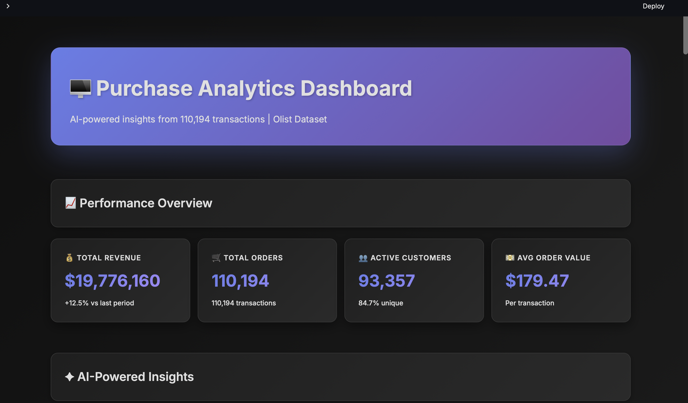
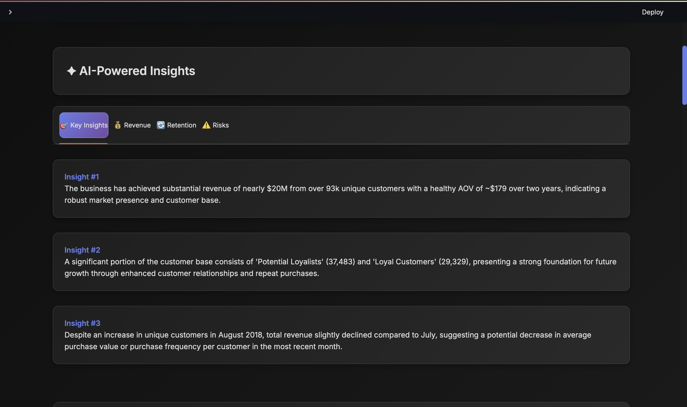
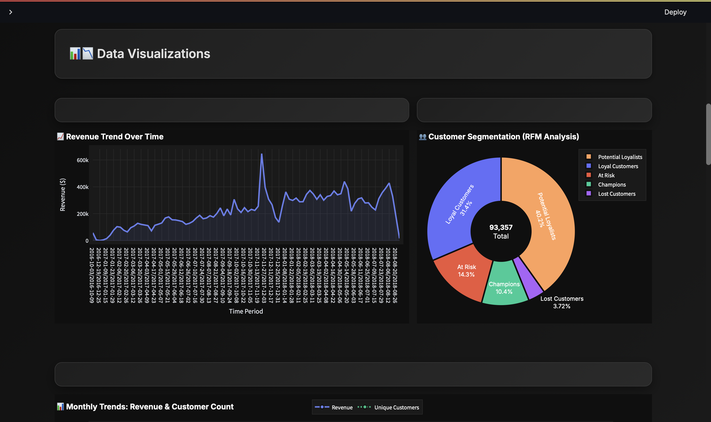

# AI-Powered Purchase Analytics Platform

> Transform transaction data into strategic insights with Google Gemini AI

[](https://streamlit.io)
[](https://python.org)
[](https://ai.google.dev)

[🚀 Live Demo](https://analyticsai.streamlit.app/) | [📊 Sample Report](#)

---

## ✨ Features

| Feature | Description |
|---------|-------------|
| 🤖 **AI Insights** | Gemini-powered strategic recommendations |
| 👥 **RFM Segmentation** | 5-tier customer classification |
| 📊 **Interactive Dashboards** | Real-time Plotly visualizations |
| 📈 **Cohort Analysis** | Retention tracking over time |
| ⚠️ **Churn Prediction** | Identify at-risk customers |
| 💡 **Segment Strategies** | AI-generated marketing tactics |
| 📋 **Executive Reports** | One-click summary generation |

---

## 🖼️ Screenshots

### Dashboard Overview


### AI-Generated Insights


### Customer Segmentation


### Data Visualization


---

## 🚀 Quick Start

### Option 1: Try Online (Easiest)

Visit the [live demo](https://analyticsai.streamlit.app/) - no installation needed!

### Option 2: Run Locally
```bash
# Clone repository
git clone https://github.com/YOUR_USERNAME/purchase-analytics-ai.git
cd purchase-analytics-ai

# Install dependencies
pip install -r requirements.txt

# Create .env file
echo "GEMINI_API_KEY=your_key_here" > .env

# Run app
streamlit run app.py
```

---

## 📊 Sample Output

### Key Metrics
```
💰 Total Revenue: $1,247,893
🛒 Total Orders: 15,234
👥 Unique Customers: 3,456
💵 Avg Order Value: $81.92
```

### AI Insights Example
```
🎯 Key Insights:
1. Electronics category drives 38% of revenue but only 22% of orders, 
   indicating high-value purchases concentrated in this segment.

2. Champion customers (top 15%) contribute 47% of total revenue, 
   suggesting strong loyalty programs are working effectively.

3. 23% of customers haven't purchased in 90+ days, representing 
   $287K in at-risk revenue requiring immediate retention efforts.

💰 Revenue Opportunities:
1. Cross-sell complementary products to Champions segment - projected 
   12% revenue increase ($149K annually).

2. Implement win-back campaign for At-Risk segment with personalized 
   offers - potential to recover 40% ($114K).
```

---

## 🏗️ Technical Architecture
```
┌─────────────────────────────────────────────┐
│           Streamlit Frontend                 │
│  (Interactive Dashboard & Visualizations)   │
└──────────────┬──────────────────────────────┘
               │
┌──────────────┴──────────────────────────────┐
│        Analysis Engine (src/)                │
│  ┌────────────┐  ┌─────────────────────┐   │
│  │ analysis.py│  │ visualizations.py   │   │
│  │ (Pandas)   │  │ (Plotly)            │   │
│  └────────────┘  └─────────────────────┘   │
│                                              │
│  ┌──────────────────────────────────────┐  │
│  │      ai_insights.py                   │  │
│  │  (Gemini API Integration)            │  │
│  └──────────────────────────────────────┘  │
└──────────────┬──────────────────────────────┘
               │
┌──────────────┴──────────────────────────────┐
│         Data Layer                           │
│  (CSV / Database / API)                     │
└─────────────────────────────────────────────┘
```

---

## 📁 Project Structure
```
purchase-analytics-ai/
├── app.py                    # Main Streamlit application
├── requirements.txt          # Python dependencies
├── .env                      # API keys (not in repo)
├── README.md                # Documentation
│
├── src/
│   ├── __init__.py
│   ├── analysis.py          # Data analysis functions
│   ├── ai_insights.py       # Gemini AI integration
│   └── visualizations.py    # Plotly chart functions
│
├── data/
│   └── purchases.csv        # Sample/demo data
│
├── .streamlit/
│   └── config.toml          # Streamlit configuration
│
└── screenshots/             # Project screenshots
```

---

## 🤖 How AI Insights Work

1. **Data Analysis**: Python/Pandas calculates metrics (RFM, trends, cohorts)
2. **Context Building**: Format data into structured prompt for LLM
3. **AI Generation**: Gemini analyzes patterns and generates insights
4. **Parsing**: Extract JSON response and display in UI
5. **Caching**: Results cached for performance

**Example Prompt:**
```
You are a retail analytics expert. Analyze this data:
- Revenue: $1.2M, Orders: 15K, AOV: $81
- Top segment: Champions (15% of customers, 47% of revenue)
- Churn risk: 23% of customers inactive 90+ days

Provide: 3 insights, 2 revenue opportunities, 1 retention strategy
```

---

## 📈 Metrics Explained

### RFM Scoring
- **Recency**: Days since last purchase (1-5, 5=recent)
- **Frequency**: Number of purchases (1-5, 5=frequent)
- **Monetary**: Total spend (1-5, 5=high value)

### Customer Segments
| Segment | RFM Score | Characteristics |
|---------|-----------|-----------------|
| **Champions** | 555, 554, 544 | Best customers - buy recently, often, and spend most |
| **Loyal** | 543, 444, 435 | Regular buyers, good value |
| **Potential** | 433, 434, 343 | Recent customers, can be developed |
| **At Risk** | 244, 334, 343 | Used to buy frequently but haven't recently |
| **Lost** | 111, 112, 121 | Lowest scores, likely churned |

---

## 🔧 Customization Guide

### Change AI Model

Edit `src/ai_insights.py`:
```python
# Use different Gemini model
model = genai.GenerativeModel('gemini-1.5-pro')

# Adjust temperature for creativity
generation_config = genai.types.GenerationConfig(
    temperature=0.7,  # 0-1, higher = more creative
)
```

### Modify Segmentation Logic

Edit `src/analysis.py` → `segment_customers()`:
```python
def segment_customers(row):
    score = int(row['r_score']) + int(row['f_score']) + int(row['m_score'])
    if score >= 14:  # Stricter Champions criteria
        return 'Champions'
    # ... modify other thresholds
```

### Add Custom Metrics

In `src/analysis.py`:
```python
def calculate_key_metrics(df):
    metrics = {
        # ... existing metrics
        'conversion_rate': df['converted'].mean(),  # Add new metric
        'cart_abandonment': 1 - df['completed'].mean()
    }
    return metrics
```

---

## 🐛 Troubleshooting

### AI Insights Not Generating

**Problem**: "Error generating insights" message

**Solutions**:
1. Check `.env` file has valid `GEMINI_API_KEY`
2. Verify API key at [aistudio.google.com](https://aistudio.google.com/)
3. Check internet connection
4. Verify API quota hasn't exceeded (check Google AI Studio)

### Slow Performance

**Problem**: App takes 30+ seconds to load

**Solutions**:
1. Sample large datasets: `df.sample(10000)` for exploration
2. Disable AI insights initially (uncheck in sidebar)
3. Use weekly aggregation instead of daily for trends
4. Cache results: Streamlit auto-caches with `@st.cache_data`

### Deployment Fails

**Problem**: Streamlit Cloud deployment error

**Solutions**:
1. Check `requirements.txt` has all dependencies
2. Verify Python version compatibility (3.8-3.11)
3. Ensure `.streamlit/secrets.toml` has API key (if deploying)
4. Check logs in Streamlit Cloud dashboard

### Data Format Errors

**Problem**: "KeyError: 'customer_id'" or similar

**Solutions**:
1. Verify CSV has required columns: `customer_id`, `transaction_date`, `total_amount`
2. Check column names match exactly (case-sensitive)
3. Ensure `transaction_date` is in recognizable format (YYYY-MM-DD)
4. Remove empty rows/columns from CSV

---

## 📊 Sample Datasets

### Included Demo Data
- 5,000 transactions
- 500 unique customers
- 8 product categories
- 2-year date range

### External Datasets (Compatible)

1. **Kaggle - Online Retail**: [link](https://www.kaggle.com/datasets/vijayuv/onlineretail)
2. **Kaggle - Brazilian E-Commerce (Olist)**: [link](https://www.kaggle.com/datasets/olistbr/brazilian-ecommerce)
3. **UCI - Online Retail**: [link](https://archive.ics.uci.edu/dataset/352/online+retail)

---

## 🎓 Learning Resources

### Technologies Used
- [Streamlit Docs](https://docs.streamlit.io/)
- [Plotly Python](https://plotly.com/python/)
- [Pandas Guide](https://pandas.pydata.org/docs/)
- [Google Gemini API](https://ai.google.dev/docs)

### Concepts Implemented
- RFM Analysis
- Cohort Retention
- Customer Lifetime Value (CLV)
- Churn Prediction
- Prompt Engineering

---

## 🤝 Contributing

This is a portfolio/educational project. Feel free to:
- Fork and customize
- Submit issues for bugs
- Suggest new features via PR
- Use as template for your projects

---

## 📝 License

MIT License - Free to use and modify

---

## 👤 Author

**Hamid Rizvi**
- LinkedIn: [linkedin.com/in/hamid-rizvi](https://linkedin.com/in/hamid-rizvi/)
- GitHub: [github.com/hamidrizvi4](https://github.com/hamidrizvi4)
- Email: hamidrizvi4@gmail.com

---

## ⭐ Acknowledgments

- Google Gemini for AI capabilities
- Streamlit for framework
- Olist for sample dataset
- NYU for project inspiration

---

<div align="center">

**If this project helped you, please ⭐ star it!**

Made with ❤️ and ☕ in NYC

</div>
